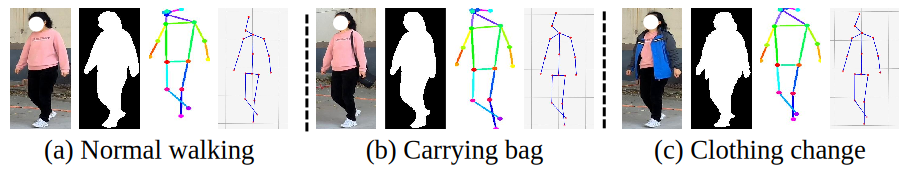

# The RA-GAR Benchmark

RA-GAR: A Richly Annotated Benchmark for Gait Attribute Recognition (AAAI 2025)

## Highlights in RA-GAR

(1) **Large-Scale Dataset**: Includes 533 identities with over 120,000 sequences captured in real-world outdoor environments.

(2) **Rich Attribute Annotations**: Annotated with 7 binary and 8 multi-class gait attributes.

(3) **Diverse Conditions**: Covers variations in viewpoints, backpack carrying, clothing styles, and illumination.

(4) **Multiple Modalities**: Provides both silhouette and pose data versions. 

## Visualization of RA-GAR




## Download RA-GAR
To obtain and use this dataset, all users are required to complete the following steps:
  1. Download and complete the latest license agreement form.
  2. Submit the completed form to BNU-IVC@outlook.com.
  3. Please use your **institutional email address** when submitting your request.
  
We will handle your requests within a week. (**Occasionally, emails may be flagged as spam. If you haven't received a response within a week, please resend your mail from an alternate email address.**)In case you encounter any issues, please feel free to reach out to us via BNU-IVC@outlook.com. <br>


## Citation
Please cite the following paper if you find this useful in your research:


```BibTeX
@inproceedings{wang2025ra,
  title={RA-GAR: A Richly Annotated Benchmark for Gait Attribute Recognition},
  author={Wang, Chenye and Hou, Saihui and Li, Aoqi and Cai, Qingyuan and Huang, Yongzhen},
  booktitle={Proceedings of the AAAI Conference on Artificial Intelligence},
  volume={39},
  number={7},
  pages={7591--7599},
  year={2025}
}
```


## Note
RA-GAR is provided strictly for **academic research purposes only**.
**Commercial use is strictly prohibited.**


****
